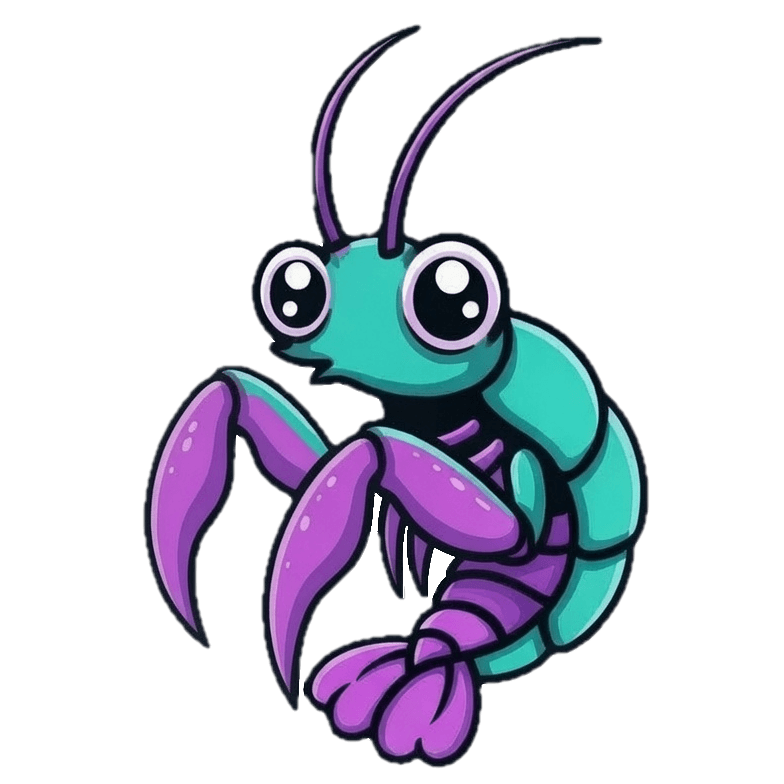
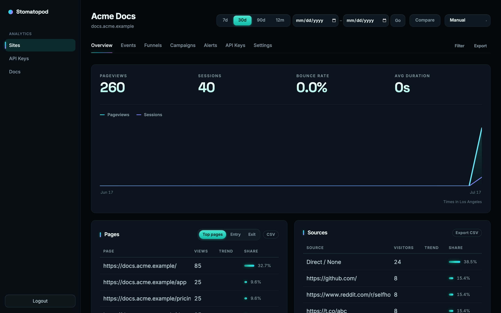
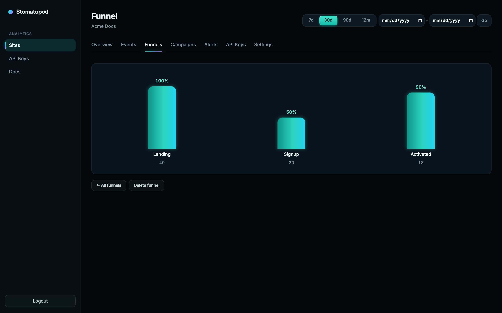
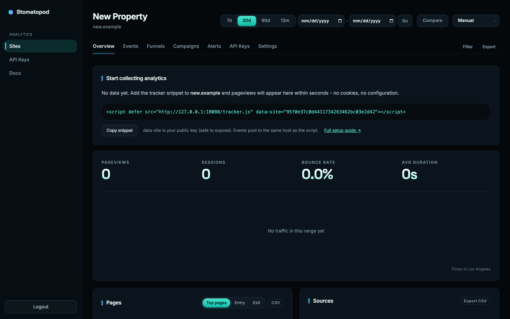

# Stomatopod

<p align="center">
  
</p>

[](./LICENSE)
[](https://stoma.top)

**Privacy-friendly, cookieless web analytics you run yourself.**

One binary (plus a small wasm dashboard), embedded storage on a local volume,
no external database. Docker Compose, a dashboard, a JSON API, and a CLI -
built for a small VPS or the same machine as the product you measure.

**One org, many sites, you own the box.** MIT licensed.

[Website](https://stoma.top) · [Compare](https://stoma.top/compare) · [Deploy guide](./DEPLOY.md) · [Benchmarks](./BENCHMARKS.md)

<p align="center">
  
</p>

<p align="center">
  
  &nbsp;
  
</p>

## Quick start (Docker Compose)

```bash
export STOMATOPOD_AUTH__SECRET_KEY="$(openssl rand -hex 32)"
export STOMATOPOD_ADMIN_PASSWORD="$(openssl rand -base64 24)"
export STOMATOPOD_ADMIN_EMAIL=you@example.com

docker compose up -d
```

Open **http://localhost:8080**, sign in with the admin password you set, create
a site, and paste the tracker snippet into your pages:

```html
<script defer src="https://your-host/tracker.js" data-site="YOUR_PUBLIC_KEY"></script>
```

Data lives in the `stomatopod_data` Docker volume (`/app/data` in the container).
Always keep that volume mounted - see [`DEPLOY.md`](./DEPLOY.md).

Image: `ghcr.io/kkir/stomatopod:latest` (rolling) or pin a release with `ghcr.io/kkir/stomatopod:v0.1.0`.
`:latest` moves with new publishes; a version tag such as `:v0.1.0` does not.

```bash
docker compose pull && docker compose up -d   # redeploy without losing data
# pin: image: ghcr.io/kkir/stomatopod:v0.1.0
```

## Features

- Cookieless browser tracker (`/tracker.js`) and server-side ingest
- Dashboard: pageviews, funnels, alerts, digests, multi-site
- REST API + OpenAPI (`/openapi.json`) and `stoma` CLI
- Embedded storage: SQLite metadata, WAL, Parquet partitions (**no Postgres/Redis**)
- Light footprint (sample: **~40 MiB RSS idle**; see [`BENCHMARKS.md`](./BENCHMARKS.md))

## Compared to common options

Short orientation for self-hosters evaluating privacy analytics tools. Numbers
and feature sets move - verify current docs for peers.

| | **Stomatopod** | Plausible CE | Umami | GoatCounter |
|---|---|---|---|---|
| Cookieless tracking | Yes | Yes | Yes | Yes |
| External DB required | **No** (embedded) | Yes (Postgres/ClickHouse) | Yes (SQL) | SQLite/Postgres |
| Process model | **Single binary** | App + DB | App + DB | Single binary |
| Footprint class | ~40 MiB idle (sample) | Heavier stack | App + DB | Very light |
| Multi-site | Yes (one owner) | Yes | Yes | Yes |
| License | MIT | AGPL | MIT | EUPL / fair use |
| API + CLI | REST, OpenAPI, `stoma` | API | API | API |

Stomatopod sits in the **Plausible/Umami-class** category with an **appliance**
ops shape: one process, mount a volume, co-host on a small box.

Longer operator notes (same table, first-boot env, when it fits):
[stoma.top/compare](https://stoma.top/compare).

## Binary (no Docker)

Published images are the main path. For a bare binary, build a release from
source (see Development below) or use the `server` artifact from
`mise run ui:bundle` / the Docker build. You still need a persistent data
directory and the same env vars:

```bash
export STOMATOPOD_AUTH__SECRET_KEY="$(openssl rand -hex 32)"
export STOMATOPOD_ADMIN_PASSWORD="$(openssl rand -base64 24)"
export STOMATOPOD_ADMIN_EMAIL=you@example.com
# point storage at a durable path
export STOMATOPOD_STORAGE__DATA_DIR=/var/lib/stomatopod
./stomatopod serve
```

Full platform notes (Fly, Railway, K8s, volumes, health probes):
[`DEPLOY.md`](./DEPLOY.md).

## API and CLI

After the appliance is up, humans and automation can use the same JSON API.

- OpenAPI: `GET /openapi.json` on your instance
- Human docs in the dashboard (and `/llms.txt` for agents)
- CLI: `stoma` (workspace package `stomatopod-cli`) for pageviews, funnels, and digests

```bash
# example once you have a read API key from the dashboard
stoma --base-url https://analytics.example.com --token rk_… pageviews --site example.com
```

## Production checklist

1. Mount a **named volume or bind mount** at `/app/data` (or set `STOMATOPOD_STORAGE__DATA_DIR`).
2. Set a long random `STOMATOPOD_AUTH__SECRET_KEY`, a strong first-boot admin password, and `STOMATOPOD_ADMIN_EMAIL`.
3. Set `STOMATOPOD_BASE_URL` to your public URL when using share links or email digests.
4. Probe `GET /health` (liveness) and `GET /ready` (readiness).

Details and PaaS examples: [`DEPLOY.md`](./DEPLOY.md).

## Development

Contributors and local iteration from source.

### Prerequisites

1. Install [`mise`](https://mise.jdx.dev/getting-started.html).
2. Install toolchain versions from `mise.toml`:

```bash
mise install
```

### First-time setup

```bash
mise run config:init
```

Then set `auth.secret_key` in `stomatopod.toml`, or export:

```bash
export STOMATOPOD_AUTH__SECRET_KEY="replace-with-a-long-random-secret"
export STOMATOPOD_ADMIN_PASSWORD="$(openssl rand -base64 24)"
export STOMATOPOD_ADMIN_EMAIL=you@example.com
```

### Daily commands

```bash
mise run dev          # wasm client + server (dashboard + /api/v1)
mise run seed         # demo traffic into a running server
mise run bench:memory # release RSS + ingest RPS ladder
mise run check        # fmt + clippy + tests
mise run test         # Rust tests only
mise run e2e          # Playwright end-to-end tests
```

#### Seeding demo data

With `mise run dev` already running:

```bash
export STOMATOPOD_ADMIN_PASSWORD='your-admin-password'
mise run seed
```

Or without login: `STOMATOPOD_PUBLIC_KEY='pk_…' mise run seed`.

Knobs: `SEED_DAYS` / `--days` (default 30), `SEED_EVENTS` / `--events`
(default 2500), `STOMATOPOD_SERVER` / `--server` (default `http://localhost:8080`).

### Dashboard UI (Dioxus fullstack)

The dashboard is a Dioxus 0.7 **fullstack** app in [`crates/web`](./crates/web),
styled with Tailwind CSS v4. The same code compiles to wasm (hydrating client)
and native (axum server + SSR).

```bash
mise run ui:build     # dx build --platform web
mise run dev          # server on :8080 with DIOXUS_PUBLIC_PATH set
mise run ui:bundle    # release web bundle (used by Docker)
```

### Marketing site

Public site in [`crates/www`](./crates/www), shared design system in
[`crates/ui`](./crates/ui). Deployed to GitHub Pages (see `.github/workflows/pages.yml`).

```bash
mise run www:serve
mise run www:bundle
```

### Workspace crates

| Crate | Path | Role |
|-------|------|------|
| `stomatopod-core` | `crates/core` | Domain, traits, config |
| `stomatopod-store` | `crates/store` | Embedded analytics storage |
| `stomatopod-ingest` | `crates/ingest` | Event ingest pipeline |
| `stomatopod-alerts` | `crates/alerts` | Alert evaluation and delivery |
| `stomatopod-api` | `crates/api` | REST API (no UI) |
| `stomatopod-ui` | `crates/ui` | Shared design system |
| `stomatopod-web` | `crates/web` | Dashboard + server binary |
| `stomatopod-www` | `crates/www` | Marketing site (SSG) |
| `stomatopod-cli` | `bin/stoma` | `stoma` query CLI |

Architecture and crate boundaries: [`ARCHITECTURE.md`](./ARCHITECTURE.md).

## Contributing

See [`CONTRIBUTING.md`](./CONTRIBUTING.md) and [`SECURITY.md`](./SECURITY.md).

## License

[MIT](./LICENSE) - Copyright (c) 2026 Kirill Kayer.
